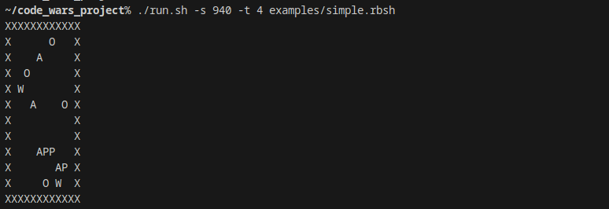
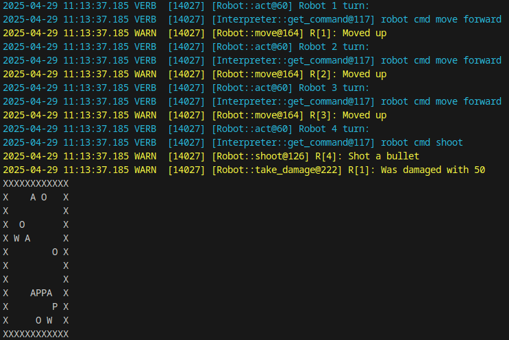
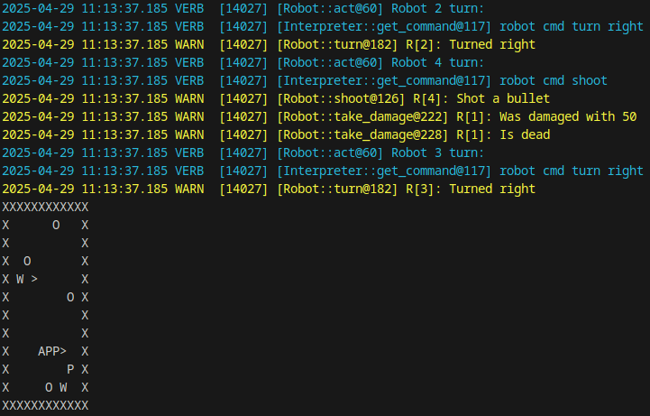
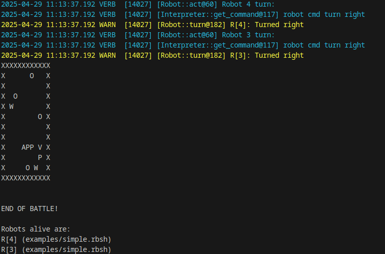

# Code Wars

Code wars is a simulation of battle of robots driven by scripts.
You can write your own but there are some example scripts in the example directory.
Have fun testing various strategies. 

## Specification and Documentation

See the docs directory for various files regarding documentation.

[Original idea](docs/proposal.md)

[Game concepts](docs/game-description.md)

[Script language](docs/language.md)

[Programming documentation](docs/programmer-docs.md)

## Requirements to run

### Hardware requirements

Supported architectures are that supported by the gcc compiler - x86/x86-64, ARM/AArch64, RISC-V,...

### Software requirements

Runs on Windows and Linux. Should also run on OS X but was not tested.

## How to compile

Ensure CMake is installed.

Build by running `./build.sh`

Or run commands manually:

This project uses external library loaded using git submodules.
Please download it with
```
git submodule update --init
```

Then to compile use a cmake-aware IDE or build with
```
mkdir build
cd build
cmake ..
cmake --build .
```

## How to run

You can use script to run by calling `./run.sh [args]` or directly `./build/code_wars [args]`.

### Usage

You need to provide at least one script file that will be used to control robots.
Then some game parameters can be specified using predefined options:

```
Usage: code_wars [OPTION]... [SCRIPT FILES]...
Code wars simulates fight of robots run by scripts

Options:
-t [number]     set number of teams/robots (default is 10)
-m [mode]       set gamemode to one of [deathmatch/teams/capture] (default is deathmatch)
-s [number]     set game seed (default is random)
-h              print help
```

## Example run

Let's look at how the game looks. The program is non-interactive simulation, it prints all turns until the end of the game.

For the example [this script](examples/simple.rbsh) was used.
The script looks like this:

```
if robot see enemy
    if robot health high
        robot cmd shoot
    else
        robot cmd move left
    endif
else
    robot cmd move forward
    robot cmd turn right
endif
```

The game was started using command `./run.sh -s 940 -t 4 examples/simple.rbsh`.
This means a deathmatch of 4 robots controlled by simple.rbsh and the game seed is 940.

Let's look how the game goes:

### Start of the game



At the start the battlefield is printed. We can see some walls (W), boxes (O), points (P) and robots facing up (A).

Then comes the first turn:

### After first turn



The log shows which commands from scripts were used by which robot (blue color) and what happened (yellow color).
We can see most of the robots simply moving but the one who sees an enemy (robot 4) shoots.

### After second turn



In the second turn some robots turned right (continuing the else branch in script) but we also get a first kill of the game.

The game continues in turns until the turn count is up or there is only one robot left.
The end of the game looks like this:

### Game over



The limit of turns was reached and 2 robots survived.